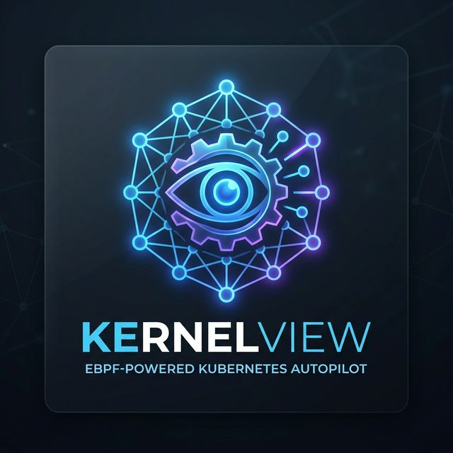

<p align="center">
  
  <h1 align="center">🔬 KernelView</h1>
  <p align="center"><strong>eBPF-powered Kubernetes Autopilot</strong></p>
  <p align="center">
    Observe at kernel level. Understand with AI. Act automatically.
  </p>
</p>

<p align="center">
  <a href="#features">Features</a> •
  <a href="#architecture">Architecture</a> •
  <a href="#quick-start">Quick Start</a> •
  <a href="#documentation">Docs</a> •
  <a href="#enterprise">Enterprise</a> •
  <a href="#license">License</a>
</p>

---

## What is KernelView?

KernelView captures everything happening inside a Kubernetes cluster at kernel level — HTTP traffic, gRPC calls, TCP connections, syscall patterns, memory pressure — and takes automated corrective action before problems become outages.

**The core thesis:** enterprises don't suffer from a lack of data. They suffer from too much data and not enough automated action. KernelView closes the loop:

```
Traditional:  observe → alert → human → (hours pass) → fix
KernelView:   observe → understand → act automatically → (seconds)
```

## Features

### Open Source (this repo)

- **🔍 eBPF Agent** — Zero-instrumentation observability via kernel hooks
  - HTTP/1.x and HTTP/2 request capture at the socket layer
  - gRPC/TLS interception via uprobes on SSL_read/SSL_write
  - TCP connection lifecycle tracking and retransmit detection
  - Per-pod syscall rate monitoring for noisy neighbor detection
  - OOM kill capture with full context (victim, reason, pressure)
  - Process execution tracking for security auditing
- **📊 Collector** — Event ingestion, aggregation, and anomaly detection
  - OpenTelemetry-compatible gRPC endpoint (OTLP on port 4317)
  - Statistical anomaly detection (latency, error rate, noisy neighbor)
  - VictoriaMetrics integration for 30-day metric retention
  - BadgerDB for 72-hour raw trace storage
- **🗺️ Dashboard** — Real-time service map and trace explorer
  - D3.js force-directed service map with health coloring
  - Per-service latency, error rate, and throughput charts
  - Individual trace search and inspection
  - Right-sizing recommendations with cost projections
- **☸️ Helm Chart** — Single-command deployment
  - `helm install kernelview deploy/helm/kernelview/`

### Enterprise (separate license)

- **🤖 AI Root Cause Analysis** — LLM-powered incident correlation
- **🔧 Automated Remediation** — CPU throttling, pod restart, network isolation
- **🔐 SSO/OIDC Authentication** — Integrate with existing identity providers
- **🌐 Multi-Cluster Support** — Single dashboard for all clusters
- **📋 Compliance Reports** — SOC2, HIPAA, PCI-DSS audit trails

## Architecture

```
Node Kernel → eBPF Ring Buffer → Agent (Go) → gRPC → Collector
                                                         ↓
                            Dashboard ← REST API ← VictoriaMetrics + BadgerDB
                                                         ↓ (Enterprise)
                                              AI Correlator → Remediation Operator → K8s API
```

| Component | Language | Deployed As | Open Source |
|-----------|----------|-------------|-------------|
| eBPF Agent | C + Go | DaemonSet (1/node) | ✅ |
| Collector | Go | Deployment (3 replicas) | ✅ |
| Dashboard | React + TypeScript | Deployment | ✅ |
| AI Correlator | Go + LLM API | Deployment | ❌ Enterprise |
| Remediation Operator | Go | Deployment | ❌ Enterprise |

## Quick Start

### Prerequisites

- Kubernetes 1.24+
- Linux nodes with kernel 5.10+
- Helm 3.x

### Install

```bash
helm repo add kernelview https://charts.kernelview.io
helm install kernelview kernelview/kernelview \
  --namespace kernelview \
  --create-namespace
```

### Verify

```bash
kubectl get pods -n kernelview
kubectl port-forward svc/kernelview-dashboard 8080:8080 -n kernelview
# Open http://localhost:8080
```

## Requirements

| Dimension | Value |
|-----------|-------|
| Target Kernel | Linux 5.10+ (all major cloud providers from 2022+) |
| Kubernetes | 1.24+ |
| Agent CPU Overhead | < 2% of one core per node |
| Agent Memory | < 200MB RSS per node |
| Event Latency | < 5 seconds kernel → dashboard |

## Development

```bash
# Build all Go binaries
make build

# Compile eBPF programs
make build-bpf

# Generate protobuf code
make generate-proto

# Run tests
make test

# Build Docker images
make docker-build

# Deploy to local kind cluster
make dev-deploy
```

## Documentation

- [Architecture Deep Dive](docs/architecture.md)
- [eBPF Agent Design](docs/agent.md)
- [Collector & Anomaly Detection](docs/collector.md)
- [Dashboard Guide](docs/dashboard.md)
- [Helm Values Reference](docs/helm-values.md)
- [Troubleshooting](docs/troubleshooting.md)

## Enterprise

KernelView Enterprise adds AI-powered root cause analysis and automated remediation on top of the open source foundation.

**[Contact Sales →](https://kernelview.io/enterprise)**

| Feature | Open Source | Enterprise |
|---------|-----------|------------|
| eBPF observability | ✅ | ✅ |
| Service map & traces | ✅ | ✅ |
| Basic alerting | ✅ | ✅ |
| Anomaly detection | ✅ | ✅ |
| AI root cause analysis | ❌ | ✅ |
| Automated remediation | ❌ | ✅ |
| SSO/OIDC | ❌ | ✅ |
| Multi-cluster | ❌ | ✅ |
| Priority support | ❌ | ✅ |

## Contributing

We welcome contributions! See [CONTRIBUTING.md](CONTRIBUTING.md) for guidelines.

## License

The open source components of KernelView are licensed under the [Apache License 2.0](LICENSE).

Enterprise components are available under a separate commercial license. Contact [sales@kernelview.io](mailto:sales@kernelview.io) for details.
